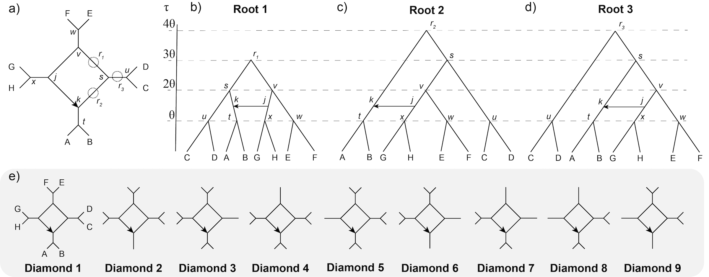

# Extracting diamonds: Identifiability of 4-node cycles in level-1 phylogenetic networks under a pseudolikelihood coalescent model

George Tiley, Nan Liu, Claudia Solis-Lemus

## Citation

This repository contains the scripts for the [Tiley et al, 2025](https://academic.oup.com/evolinnean/advance-article/doi/10.1093/evolinnean/kzaf019/8257700) manuscript:

```
@article{tiley2025extracting,
  title={Extracting Diamonds: Identifiability of 4-node Cycles in level-1 Phylogenetic Network},
  author={Tiley, George and Liu, Nan and Sol{\'\i}s-Lemus, Claudia},
  journal={Evolutionary Journal of the Linnean Society},
  pages={kzaf019},
  year={2025},
  publisher={Oxford University Press}
}
```

## Theory: Is a level-1 4-cycle network identifiable given the set of possible networks?
* data simulated under the multispecies coalescent with introgression (MSci) model (Flouri et al. 2020)
* networks re-estimated using the true toplogies based on unrooted quartets (Solís-Lemus and Ané 2016)
* networks re-estimated using the true topologies based on rooted triples (Yu and Nakhleh, 2015)



We are interested in the identifiability of a blob with four nodes (a diamond - Fig. 1a), and how different rootings and sampling could affect this in practice. One could consider a rooting that balances the backbone species tree (Fig. 1b), ladderizes the species tree such that the direction of gene flow is into the outgroup (Fig. 1c), or ladderizes the species tree but constrains gene flow between ingroup lineages (Fig. 1d). Taxon sampling is then investigated for each rooting by having two children per parent node, then one child for one or two parent nodes (Fig. 1e).


### References
Flouri T, Jiao X, Rannala B, Yang Z. 2020. A Bayesian implementation of the multispecies coalescent models with introgression for phylogenomic analysis. *Mol. Biol. Evol.* 37:1211-1223.<br>
<br>
Solís-Lemus C, Ané C. 2016. Inferring phylogeneic neetworks with maximum pseudolikelihood under incomplete lineage sorting. *PLoS Genet.* 12:e1005896.<br>
<br>
Tiley GP, Solís-Lemus C. 2023. Extracting diamonds: Identifiability of 4-node cycles in level-1 phylogenetic networks under a pseudolikelihood coalescent model. *bioRxiv* https://doi.org/10.1101/2023.10.25.564087.<br>
<br>
Yu Y, Nakhleh L. 2015. A maximum pseudo-likelihood approach for phylogenetic networks. *BMC Genomics* 16:S10.<br>

## Scripts

The scripts for simulating gene trees for diamonds 1 through 9 for each root are given in `scripts-for-simulation`. The basic templates and helper scripts for analyzing these simulated data are in `scripts-for-analyses`. Results are summarized in a tabular format in `simulation-results`. Methods are described in detail in [Tiley and Solís-Lemus (2023)]((https://www.biorxiv.org/content/10.1101/2023.10.25.564087v1)).

## License

Our code is licensed under the
[MIT License](https://github.com/solislemuslab/dna-nn-theory/blob/master/LICENSE) &copy; George Tiley (2022).

